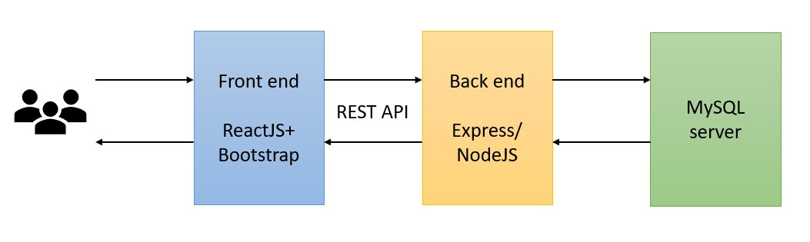
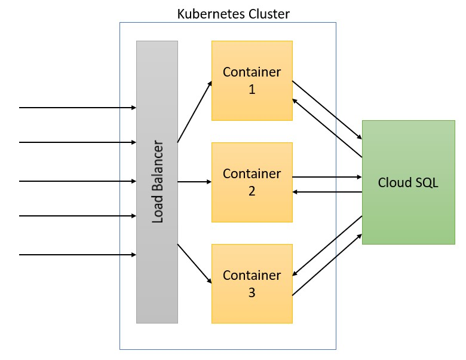
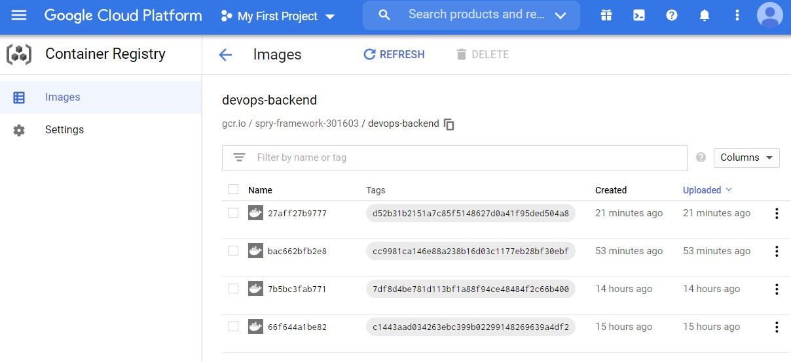
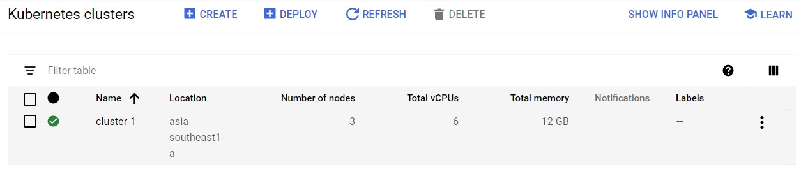
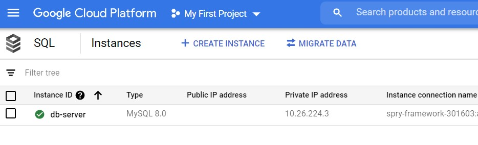
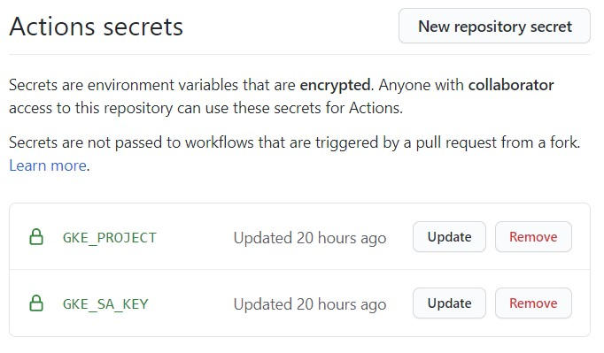
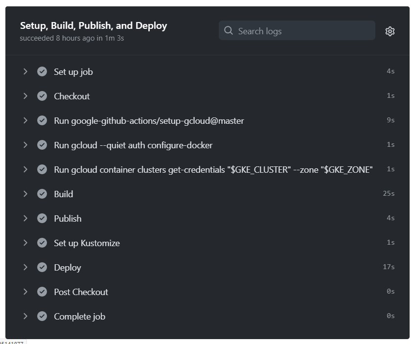
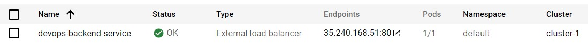
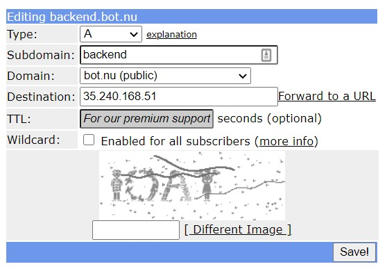

# DevOps Ci/CD Project: Build, Package and Deploy
## By: Erwin Lo


## Background
In our full stack development project, we developed a website that aggregates different financial accounts and presents it in a dashboard.
Front end website was developed using ReactJS and Bootstrap, while Back end was developed using Express/NodeJS and communicates with MySQL server.
Front end communicates with Back end server using REST API GET, POST, PUT, DELETE requests. 



This back end server will serve as a good example for how we are going to build Ci/CD pipeline and implement in cloud infrastructure.


## Implementation in the cloud
I am going to implement this project using Google Cloud infrastructure. There are a few products used for this implementation:
* Docker to containerise back end server
* Google's Container Registry to host the docker image
* Google's Kubernetes Engine to manage a cluster of containers and load balancer.
* Google's Cloud SQL to store the database. (PaaS)



### 1. Container Registry



The container registry stores all docker images that are pushed by Github Actions.

### 2. Kubernetes



Kubernetes is used to orchestrate containers. It has autoscaling feature that will increase or decrease the number of pods based on load.
A Load balancer is implemented to send traffics to different pods.

### 3. Cloud SQL



Cloud SQL stores the database, as it is not a good idea to run our database server in a container.
MySQL server can be run in a VM instance, but it will take more time to maintain not just the database but also the underlying server.
Express server will connect to Cloud SQL using private IP address.


## Building CI/CD Pipeline
Since the project is hosted in Github, we can leverage Github Actions to automate our CI/CD Pipeline.
We are going to use the workflow to build, package, and deploy to Google cloud.

### 1. Build and Package
We will use docker to build and package our project. A Dockerfile is needed to tell Docker the steps to containerise our application.
Below is the Dockerfile recipe:

```Dockerfile
FROM node:lts-alpine
MAINTAINER erwinlo@u.nus.edu

# Create app directory
WORKDIR /usr/src/app

# Copy package*.json for dependencies requirements
COPY package*.json ./

# Install all required dependencies
RUN npm install

# Bundle app source
COPY . .

# Expose port 7000 for our backend server
EXPOSE 7000

# Start server
CMD ["node", "./bin/www"]
```

This will result in a container image with size of 133MB because we use alpine linux.

### 2. Github Actions workflow
We will use [this workflow](.github/workflows/google.yml) to build, package, and deploy our app to Kubernetes.

This workflow will be triggered when there is new code pushed to Github.
```yaml

on:
  push:
    branches: [main]

```

Google's Project ID and Service Account key need to be stored in Github Secrets, so that the workflow can publish to google cloud successfully.


The workflow will then build our docker image based on Dockerfile we created.
```yaml
  - name: Build
      run: |-
        docker build \
          --tag "gcr.io/$PROJECT_ID/$IMAGE:$GITHUB_SHA" \
          --build-arg GITHUB_SHA="$GITHUB_SHA" \
          --build-arg GITHUB_REF="$GITHUB_REF" \
          .
```

Then, push it to Google's container registry
```yaml
  - name: Publish
      run: |-
        docker push "gcr.io/$PROJECT_ID/$IMAGE:$GITHUB_SHA"
```

Finally, the container will be rolled out to Kubernetes engine for deployment.
```
kubectl rollout status deployment/$DEPLOYMENT_NAME
```


## Running the CI/CD workflow
When there is any push to github repo, Github actions will automatically trigger the workflow


The code was successfully built, packaged into docker container, and published to Google's Kubernetes cluster.

## Accessing the server
We can access the backend server by going to the ip address of Google's load balancer: [http://35.240.168.51](http://35.240.168.51)



## Setting up subdomain to point to server's ip address
The last step is creating a subdomain for our backend server. This subdomain will be easier to remember and type instead of ip address.
We can use the free service of freedns.afraid.org where many domains are available to be used.


Our backend server can be accessed at [http://backend.bot.nu](http://backend.bot.nu)

Some API endpoints that can be accessed on our server:
* [http://backend.bot.nu/users/2](http://backend.bot.nu/users/2)
* [http://backend.bot.nu/transactions/2](http://backend.bot.nu/transactions/2)
* [http://backend.bot.nu/bankss/2](http://backend.bot.nu/banks/2)
